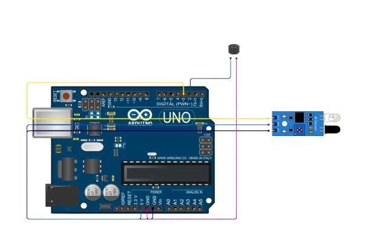

# Arduino IR Sensor Object Detection Alarm

  

This is an Arduino project that uses an **IR sensor** and a **buzzer** to detect objects.  
When an object is detected by the IR sensor, the Arduino activates the buzzer to produce an alarm sound.  
It’s a simple and beginner-friendly project for learning about sensors and Arduino I/O.

---

## About The Project

The Arduino IR Sensor Alarm project connects an IR sensor to the Arduino UNO.  
The sensor continuously checks for objects in its path. If an object is detected, it sends a signal to the Arduino, which in turn **activates the buzzer**.  

This project demonstrates:
- How digital sensors interact with Arduino  
- How to use **digitalRead** and **digitalWrite**  
- A real-world application of object detection and alerts  

---

## Built With

- <a href="https://www.arduino.cc/">
     Arduino
</a>

---

## Getting Started

### Components Needed
- Arduino UNO  
- IR Sensor Module  
- Buzzer  
- Jumper Wires  
- Breadboard (optional)  

### Circuit Connections
| Component   | Arduino Pin |
|-------------|-------------|
| IR Sensor VCC | 5V |
| IR Sensor GND | GND |
| IR Sensor OUT | D3 |
| Buzzer (+) | D2 |
| Buzzer (–) | GND |

### Steps
1. Assemble the circuit as shown in the diagram (`Diagram.png`).  
2. Upload the provided `main.ino` file to your Arduino UNO.  
3. Open Serial Monitor (9600 baud) to view logs.  
4. Place an object in front of the IR sensor → the buzzer will sound.  

---

## Contributing
This project is open for improvements. Feel free to fork the repository and make it better 🚀.  
