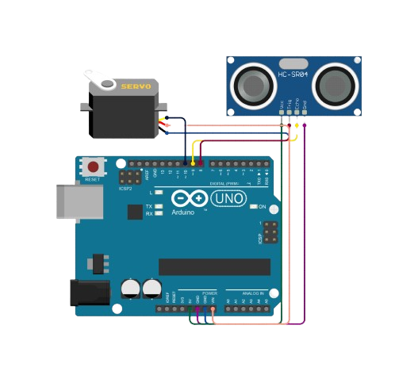

# Arduino Radar Detection System

  

This project implements a **Radar Detection System** using an **Arduino**, **ultrasonic sensor**, and **Processing** for real-time visualization.  
The system detects objects by measuring distance and angle, and displays the results on a radar-style graphical interface via serial communication.  

It is designed as a learning-oriented project that combines **embedded systems**, **sensors**, and **computer-based visualization**.

---

## About The Project

The Radar Detection System uses an ultrasonic sensor mounted on a servo motor to scan its surroundings across a defined angular range.  
At each angle, the sensor measures the distance to nearby objects and sends the data to a Processing application running on a computer.

The Processing sketch renders:
- A semi-circular radar interface  
- A rotating sweep line  
- Detected objects plotted based on distance and angle  

This project demonstrates:
- Serial communication between Arduino and Processing  
- Real-time data visualization  
- Object detection using ultrasonic sensors  
- Integration of hardware and software systems  

---

## Built With

- <a href="https://www.arduino.cc/">
     Arduino
</a>
  
- Ultrasonic Sensor (HC-SR04)  
- Servo Motor  
- Processing (Java-based visualization framework)  

---

## Getting Started

### Components Needed
- Arduino UNO / Nano (or compatible board)  
- Ultrasonic Sensor (HC-SR04)  
- Servo Motor  
- Jumper Wires  
- Breadboard  
- USB Cable  

### Circuit Connections
| Component | Arduino Pin |
|---------|-------------|
| Ultrasonic VCC | 5V |
| Ultrasonic GND | GND |
| Ultrasonic TRIG | D9 |
| Ultrasonic ECHO | D10 |
| Servo Signal | D6 |
| Servo VCC | 5V |
| Servo GND | GND |

### Steps
1. Assemble the circuit as shown in `circuit_image.png`.  
2. Upload the Arduino sketch to the board using Arduino IDE.  
3. Open the Processing sketch and update the serial port if required (e.g., COM7).  
4. Run the Processing program to view the radar interface.  
5. Place objects in front of the sensor to observe real-time detection.  

---

## Applications
- Object detection systems  
- Robotics and obstacle avoidance  
- Embedded systems education  
- Sensor data visualization  

---

## Contributing

This project is open for improvements.  
Feel free to fork the repository, enhance the system, and submit a pull request.
